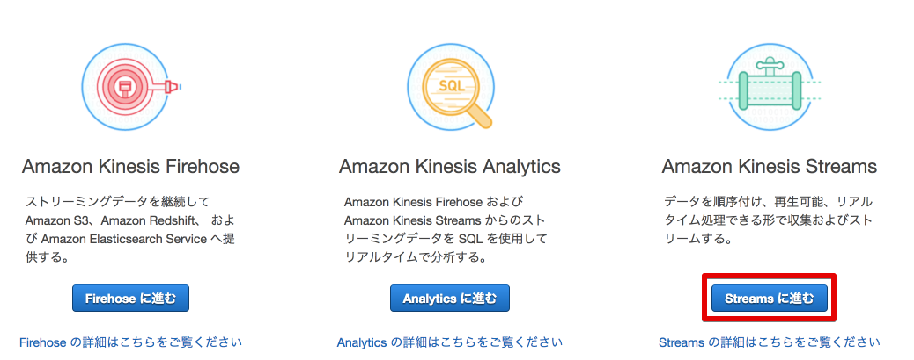
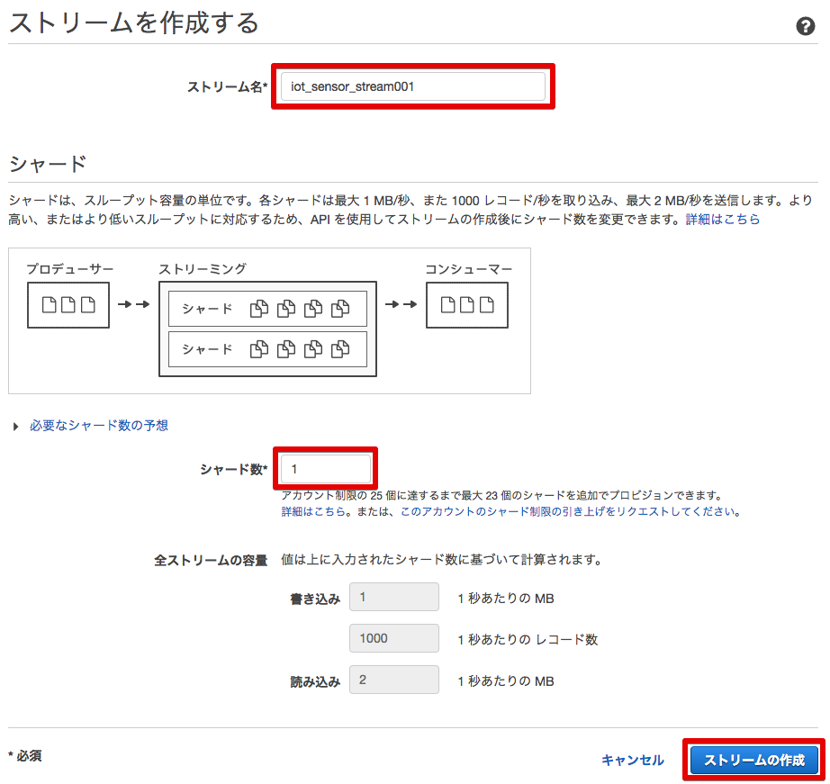
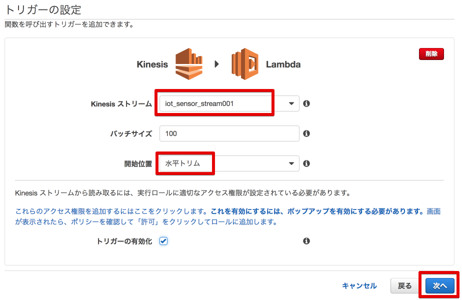

====================
センサーデータの送信
====================

Intel Edisonに接続された照度センサーのデータを外部サービスのKintoneへ送信します。
EdisonはAWS IoTのトピックにデータをパブリッシュし、AWS IoTでルールに基づきKinesisへデータを渡し、Lambdaへ送られ、Lambda関数が実行されます。

.. image:: images/senario1.png

|

センサーデータは以下のJSONフォーマットとします。

::

  {
    "timestamp": "2015-10-24T14:16:37.305Z", ←ISO8601形式
    "value": "300"                           ←アナログ値
  }

|

Kinesisストリームの作成
====================

サービス：Kinesisへ移動します。

[Streamに進む]を押して、Kinesis Stream設定画面へ移動します。

スクリーンショットの赤枠で囲んだ部分について、以下の項目を入力します。
任意の番号の部分は他のユーザと被らない数字を入力してください。

=========================== ==============================
設定項目                             値
=========================== ==============================
ストリーム名                      iot_sensor_stream<任意の番号>
シャード数                           1
=========================== ==============================

[ストリームの作成]をクリックします。

AWS IoT ルールの作成
====================

メニューのRulesをクリックし[Create]をクリックします。

.. image:: images/5-create-rule-1.png

|

スクリーンショットの赤枠で囲んだ部分について、以下の項目を入力します。
任意の番号の部分は他のユーザと被らない数字を入力してください。

=========================== ==============================
設定項目                          値
=========================== ==============================
Name                        SendtoKinesis<任意の番号>
SQL Version                 2016-03-23
Description                 任意
Attribute                   topic(2) as deviceid,*(アスタリスク)
Topic Filter                edison/illuminance<任意の番号>
=========================== ==============================

|

[Add action]をクリックします。

.. image:: images/5-create-rule-3-2.png

Select an action画面で、"Select an action"から"Sends messages to an Amazon Kinesis stream"を選択し、[Configure action]をクリックします。

|

.. image:: images/5-create-rule-4-2.png

"Configure action"画面で、以下の値を入力します。

=================================== ===========================
設定項目                                         値
=================================== ===========================
Stream name                          awsiot-handson-table<任意の番号>
Partition key                        timestamp()
=================================== ===========================

|

.. image:: images/5-IOT-Configure-Action.png

|

[Create a new role]をクリックし、AWS IoTからKinesisへトピックを送信するためのRoleを作成します。
別画面が出てきますので、ロール名として"AWSIoTHandsonKinesis"と入力し、再度[Create a new role]をクリックします。
これによって入力したロール名が選択できるようになるので、作成したロールを選択し、[Upate role]をクリックし、次に[Add action]をクリックします。

"Kinesis Action"が追加されたことを確認したら、[Create rule]をクリックします。

.. image:: images/5-create-rule-6-1.png

|

ルールが作成されたことを確認します。

|

Lambdaの設定
================

サービス：Lambdaに移動し、"Lambda関数の作成"をクリックします。

.. image:: images/5-Lambda-cretae.png

|

設計図の選択画面で、フィルターに"Kinesis"と入力し、"kinesis-process-record-python"をクリックします。

|

"トリガーの設定"画面で、以下の値を入力します。

=================================== ===========================
設定項目                                         値
=================================== ===========================
Kinesis ストリーム                          iot_sensor_stream<任意の番号>
開始位置                                    水平トリム
=================================== ===========================

[次へ]をクリックします。

|

"関数の設定"画面で、名前 "kintone_function"と入力します。
コード エントリ タイプで"S3から..."を選択し、下記のURLを入力します。

::

  https://s3-ap-northeast-1.amazonaws.com/aws-iot-handson-basic/kintone_1st.py

|

IAM role = lambdabasicexecution

|

プログラムの実行
================

照度センサーから照度データを取得し、AWS IoTのメッセージブローカーへ送信するためのプログラムを実行します。サンプルプログラム内のawsiot-handson-fundamentals配下のsensorに移動し、プログラムを実行します。

::

  root@edison:~awsiot-handson-fundamentals/sensor# node main.js  edison/illuminance<任意の番号>

  Publish: {"timestamp":"2015-10-24T14:16:37.305Z","value":268}
  Publish: {"timestamp":"2015-10-24T14:16:38.365Z","value":268}
  Publish: {"timestamp":"2015-10-24T14:16:39.424Z","value":271}
  Publish: {"timestamp":"2015-10-24T14:16:40.484Z","value":270}
  Publish: {"timestamp":"2015-10-24T14:16:41.535Z","value":272}

|

AWS IoTのTestにて、"Subscription topic"に "edison/illuminance<任意の番号>" を入力すれば、トピックがPublishされていることが分かります。

|

センサーデータを確認する
================

このURLからKintoneのグラフを参照できます、

https://n58cb.cybozu.com/k/24/report?report=5113210

|

=================================== ===========================
項目                                         値
=================================== ===========================
ユーザ名                                    demo
パスワード                                  Password2
=================================== ===========================

|

.. image:: images/5-Kintone-Graph.png

|
